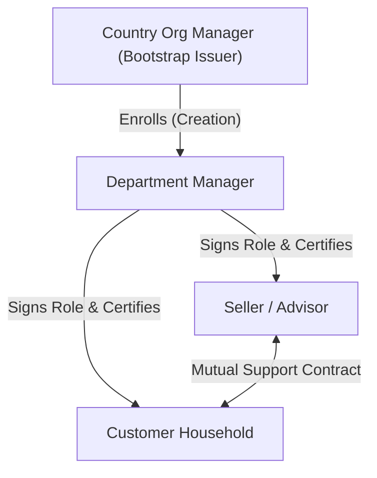
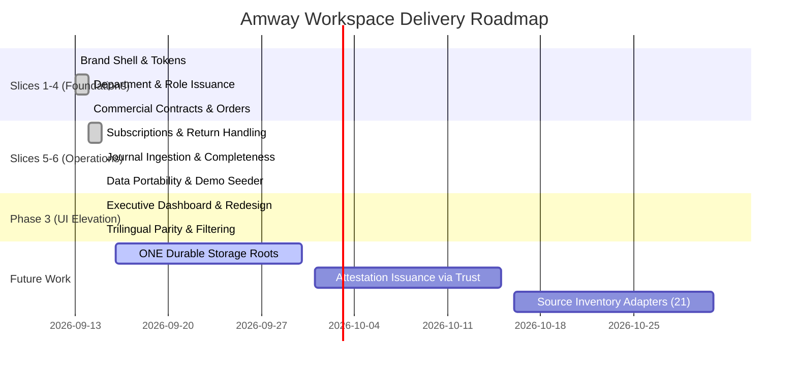

# Amway Workspace on Projektor PRD

**Document Status**: Final Specification (v1.0)  
**Target Surface**: Dedicated Workspace at `https://projektor.one/amway` & Loopback Service  
**Implementation References**: [`docs/amway-app-book.md`](./amway-app-book.md), [`docs/amway-business-research.md`](./amway-business-research.md), [`packages/amway.app`](../packages/amway.app), [`packages/shop.amway`](../packages/shop.amway), [`scripts/amway-server.mjs`](../scripts/amway-server.mjs)

---

## 1. Objective

Provide a secure, local-first commercial workspace for independent direct sales organizations, business owners (sellers/advisors), department managers, and customer households. The workspace enables sovereign management of product catalogs, orders, subscriptions, inventory reservations, earnings reconciliation, customer relationships, and contract-governed advisory chat—grounded in ONE's cryptographic identity and immutable causal audit trails.

The application delivers an executive, enterprise-grade user experience modeled on the official German market reference ([amway.de](https://www.amway.de/)) with full trilingual support (German, English, French) and strict multi-party privacy boundaries.

---

## 2. Product Context & Business Vision

Direct selling and multi-tiered retail businesses often suffer from fragmented, opaque, and centralized software tools:
1. **Opaque Point/Revenue Accounting**: Bonus point systems (PV/BV) are frequently conflated with real monetary ledgers or obscured behind proprietary cloud portals.
2. **Directory & Privacy Leaks**: Customer relationships and contact information are often exposed broadly across upline teams without explicit consent.
3. **Inventory & Order Disconnects**: Local facility-held stock is frequently confused with direct warehouse shipments, leading to overselling or phantom inventory.
4. **Lack of Verifiable Auditability**: Historical price changes, role assignments, and return settlements lack cryptographic proof of provenance.

### The Solution on Projektor
The Amway Workspace on Projektor adapts the proven **Flexibel StudyCenter** organizational pattern to commercial enterprise operations. Every department operates as an autonomous, self-sovereign namespace. Operations are executed through authenticated ONE instances, mutations emit tamper-evident journal events, and cross-party communication is authorized exclusively through explicit, signed support contracts.

---

## 3. User Roles & Authority Matrix

Authority is strictly fail-closed, scoped to a specific department, and governed by signed issuance edges:



| Role | Intended Authority & Scope | Data Boundary & Privacy |
|---|---|---|
| **Admin / Org Manager** | Bootstraps departments, enrolls department managers, configures brand policies, audits system integrity. | Cannot inspect private chat messages or individual customer records across departments. |
| **Department Manager** | Operates department facility/store, manages member roster, issues invitations, certifies published contacts, custodies facility inventory. | Full operational visibility within their department; cannot access sibling departments. |
| **Seller (Berater / Advisor)** | Curates product offers, creates customer reservations/orders, manages recurring subscriptions, tracks margins/earnings, conducts advisory chat. | Accesses only assigned customer contracts, their own sales ledger, and shared department catalog. |
| **Customer (Household)** | Explores authorized catalog, places orders, manages recurring subscriptions, initiates returns, chats with designated advisor. | Phonebook and transaction history are isolated; sees only their certified advisor and own orders. |

> [!IMPORTANT]
> A role grant does **not** confer legal goods title or employment status. Facility operators, stock custodians, and goods owners remain distinct cryptographic identities.

---

## 4. Product Principles & Architecture Rules

1. **Local-First & Durable Cryptographic Identity**:
   - The workspace server boots exactly one ONE instance unlocked via `POST /session`.
   - The instance owner identity hash signs all mutations. No unverified third-party data is trusted without explicit elevation.
2. **Strict Department Scope**:
   - Every domain object (assignment, contract, order, reservation, event) is partitioned under canonical department namespaces (`amway.department.v1:<id>`).
   - Cross-department operations are denied at action-time.
3. **Separation of Points (PV/BV) and Monetary Value**:
   - Point Values (PV) and Business Volume (BV) are preserved as performance metrics and never converted into speculative Euro balances.
   - All monetary values are represented and settled in integer minor units (e.g., cents in EUR).
4. **Physical Inventory vs. Direct Fulfilment Separation**:
   - Orders fulfilled from local facility stock decrement verified reservation lots.
   - Direct manufacturer orders carry their own fulfilment provenance and never decrement fictitious local stock.
5. **Causal Audit Journal with Completeness Cuts**:
   - Every role assignment, revocation, order admission, stock reservation, and payment settlement emits an immutable event.
   - The journal guarantees producer completeness and chronological ordering.
6. **Contract-Authorized Communication**:
   - Advisory chat requires an active, signed contract between customer and seller. Unpublishing a directory entry does not revoke chat; explicit contract revocation is required.

---

## 5. Functional Requirements by Module

### 5.1. Authentication & Workspace Unlock (`auth`)
- **Centered Corporate Portal**: Rendered when no active session cookie exists, featuring the official Amway wordmark, language selector, email input, password input, and cryptographic reassurance footnote.
- **Session Gate**: Authenticates against ONE instance storage (`POST /session`). Rejects duplicate unlock attempts (`409 Conflict - auth.locked`) until server restart.
- **Security Headers**: Enforces strict `Content-Security-Policy`, `X-Content-Type-Options: nosniff`, and Same-Origin / Localhost request gating (`127.0.0.1` / `localhost`).

### 5.2. Scope Navigation & Department Switcher (`scope`)
- **Scope Banner**: Always-visible contextual header bar showing the active department name, scope badge, and quick-switch action.
- **Quick-Select Chips**: If unassigned, lists all registered departments discovered via `getScope` as one-click chips alongside a manual department ID input.

### 5.3. Executive Overview Dashboard (`overview`)
- **System Integrity KPIs**: Department count, total commercial transactions, journal completeness status, and instance owner hash.
- **Department Performance Metrics**:
  - Settled Cash Revenue & Open Receivables (in formatted EUR).
  - Total Booked Orders & Active Subscriptions count.
  - Catalog Item count & Active Offers count.
  - Active Members count.
- **Dashboard Breakdown Cards**:
  - *Order Breakdown*: Status breakdown (`accepted`, `fulfilled`) with colored status pills.
  - *Role Distribution*: Member counts categorized by role (`manager`, `seller`, `customer`, `admin`).
  - *Inventory & Reservations*: Held vs. Consumed reservation lots.

### 5.4. People, Directory & Invitations (`people`)
- **Invitation Hub**:
  - Role selection (`seller` / `customer`) and generation of ecosystem-shaped invitation URLs (`https://projektor.one/amway/invite/<token>`).
  - Active invitations table with role badge, copy-to-clipboard button with visual feedback, and revoke button.
  - Invitation acceptance form (URL, Person ID, Display Name) for manual pairing.
  - Automated transport pairing completion via `pairingComplete` listener with primed connection intent.
- **Team & Role Assignments**:
  - Itemized table showing Subject display name, Role badge, Issuer name, and Validity/Revocation status (`Aktiv` / `Widerrufen`).
- **Certified Contacts & Phonebook**:
  - Directory table displaying Contact Name, Person ID, Role, and Certification Badge (`✓ Verifiziert` if signed by department manager).

### 5.5. Product Catalog & Offers (`products`)
- **Assortment Organization**: Categorized into official Amway lines: *Ernährung* (Nutrilite, bodykey, XS), *Schönheit* (Artistry, Satinique, Glister, G&H), and *Haushalt* (Amway Home, eSpring, iCook, Atmosphere Sky).
- **Interactive Search & Filter**:
  - Live text search across product names, brands, and item numbers.
  - Category filter chips (*Alle*, *Ernährung*, *Schönheit*, *Haushalt*) with instant client-side filtering.
- **Commercial Display**: Formatted unit prices, dedicated PV/BV point badges, category color badges, and sales channel tags (`direct`, `facility`).

### 5.6. Orders & Subscriptions (`orders`)
- **Order Pipeline**:
  - Transactions table listing Order ID, Channel, Seller, Formatted Total, and Lifecycle Status (`accepted`, `fulfilled`).
  - Multi-line item inspection with quantity, item name, and price breakdown.
- **Recurring Subscriptions**:
  - Subscriptions table listing Subscription ID, Customer mapping, and status.
  - Idempotent occurrence generation preventing duplicate billing.

### 5.7. Inventory & Reservations (`inventory`)
- **Stock Reservations Table**:
  - Tracks Reservation ID, Transaction ID, Lot identifier (monospace), Quantity, and Status (`held`, `consumed`, `released`).
  - Summary KPI cards for Held lots vs. Consumed lots.
  - Concurrent last-unit protection preventing overselling.

### 5.8. Sales Ledger & Earnings Reconciliation (`earnings`)
- **Financial Stat Cards**: Settled Cash, Open Receivables, Recognized Revenue.
- **Transaction Ledger**: Itemized ledger comparing Transaction Total, Recognized Revenue, Receivable balance, and Cash collected.
- **Statements Reconciliation**: Reconciliation view for periodic statement imports without reconstructing speculative bonus formulas.

### 5.9. Returns & Claims Handling (`returns`)
- **Return Cases Table**: Case ID, Original Transaction reference, Processing Status (`in_review`, `resolved`), and Resolution Decision (refund, replacement, rejection).

### 5.10. Advisory Chat & Contracts (`chat`)
- **Contract Ledger**: Active advisory agreements linking Customer households to designated Sellers/Advisors, stating purpose, validity window, and revocation state.

### 5.11. Audit Journal & Event Inspector (`journal`)
- **Master-Detail Timeline**:
  - *Left Feed*: Chronological feed of occurrences (newest first) with category badges, relative/formatted timestamps, actor tags, and semantic description templates with resolved participant names.
  - *Right Inspector*: Sticky detail pane displaying structured key-value table of the raw event attributes, cryptographic provenance, and transaction metadata.

### 5.12. Settings, Data Portability & Trust (`settings`)
- **Account & Session**: User email, instance hash, and server restart instruction.
- **Appearance & Language**:
  - Theme switcher: Light, Dark, System (persisted locally and to `settings.core`).
  - Language switcher: German, English, French.
- **Department Data Portability**:
  - **Export JSON**: Self-contained export envelope modeled on VGER memories format, including trust block, department state, catalog, orders, and event log.
  - **Import JSON**: File upload with cryptographic validation. Unverified imports prompt for explicit signer trust elevation (`Trotzdem vertrauen`).
  - **Load Demo Department**: One-click seeding of `demo-de` (34 items across all lines, multiple sellers, customer subscriptions, settled sales) and `demo-de-west`.
- **Trust Chain & Signers**:
  - Visual hierarchy: Organization Manager $\rightarrow$ Enrolled Manager $\rightarrow$ Department Manager.
  - Trusted Exporters management with Add/Remove capabilities.

---

## 6. Technical Specifications & Data Models

### 6.1. Component Architecture

```
┌─────────────────────────────────────────────────────────────┐
│                   Browser UI (amway.app/ui)                 │
│  - index.html (Semantic Shell)                              │
│  - styles.css (Brand Design Tokens, Dark/Light Mode)        │
│  - app.js (Screen Loaders, State Management, DOM Engine)    │
│  - i18n.js (Trilingual Dictionary: DE / EN / FR)            │
└──────────────────────────────┬──────────────────────────────┘
                               │ JSON over HTTP (Loopback)
┌──────────────────────────────▼──────────────────────────────┐
│                Workspace Server (amway-server.mjs)          │
│  - Port 4176 (or AMWAY_PORT), Host Header & Origin Check    │
│  - Session Management & Anti-CSRF Token Validation          │
│  - OperationRegistry: 'amway' & 'amwayAppBook' operations   │
└──────────────────────────────┬──────────────────────────────┘
                               │ In-Memory & ONE Domain State
┌──────────────────────────────▼──────────────────────────────┐
│                     Domain Core Packages                    │
│  - packages/amway.app (Departments, Invites, PhoneBook)     │
│  - packages/shop.amway (Shop, Lifecycle, Journal, Returns)  │
│  - packages/one.core & refinio.api (Instance & Registry)    │
└─────────────────────────────────────────────────────────────┘
```

### 6.2. Core Data Entities

```typescript
interface DepartmentRecord {
  id: string;
  name: string;
  scope: string; // "amway.department.v1:<id>"
  manager: string; // "person:<id>"
  createdBy: string;
  createdAt: number;
}

interface RoleAssignment {
  id: string;
  department: string;
  subject: string;
  role: "admin" | "manager" | "seller" | "customer";
  issuer: string;
  validFrom: number;
  validUntil: number | null;
  revokedAt: number | null;
}

interface TransactionRecord {
  id: string;
  department: string;
  channel: "direct" | "facility";
  seller: string;
  lines: Array<{
    item: string;
    quantity: number;
    unitPrice: { amount: number; currency: string };
  }>;
  total: { amount: number; currency: string };
  ledger: {
    status: "accepted" | "fulfilled" | "settled" | "cancelled";
    recognized: number;
    receivable: number;
    cash: number;
  };
}

interface ExportEnvelope {
  format: "amway.department.v1";
  exportedAt: number;
  exportedBy: string;
  department: DepartmentRecord;
  assignments: RoleAssignment[];
  contacts: any[];
  catalog: { items: any[]; offers: any[]; priceLists: any[] };
  transactions: TransactionRecord[];
  reservations: any[];
  subscriptions: any[];
  journal: Array<{ type: string; atTime: number; [key: string]: any }>;
  trust: {
    status: "verified" | "unverified";
    signer: string;
  };
}
```

---

## 7. Brand Design System & UI Specifications

The design adheres to the observed visual identity of [amway.de](https://www.amway.de/):

| Design Token | Light Mode Value | Dark Mode Value | Usage |
|---|---|---|---|
| `--amway-surface` | `#FFFFFF` | `#121417` | Base card and page surface |
| `--amway-surface-subtle` | `#F8F9FA` | `#232730` | Main canvas background, header pills |
| `--amway-ink` | `#212529` | `#F1F3F5` | Primary text and headings |
| `--amway-muted` | `#6C757D` | `#9AA2B1` | Labels, timestamps, secondary hints |
| `--amway-accent` | `#38539A` | `#8BA3D9` | Brand primary, action buttons, active tabs |
| `--amway-nutrition` | `#546223` | `#98B845` | Nutrilite / Nutrition badges & cards |
| `--amway-beauty` | `#7F3E3E` | `#D98888` | Artistry / Beauty badges & cards |
| `--amway-home` | `#396E75` | `#6BBCC7` | Amway Home / Appliances badges & cards |
| `--amway-success` | `#1B7A43` | `#4ADE80` | Fulfilled / Certified / Connected status |
| `--amway-warning` | `#B45309` | `#FBBF24` | Held stock / Pending / Unverified warnings |

- **Typography**: System sans-serif font stack (`system-ui, -apple-system, Segoe UI, Roboto, Helvetica Neue, Arial, sans-serif`) with `font-variant-numeric: tabular-nums` on all figures.
- **Official Asset**: Wordmark SVG from `assets/amway-logo-black.svg` preserved at 71:24 aspect ratio (inverted in dark mode).

---

## 8. Acceptance Criteria

### Security & Access Control
- [x] Unlocking via `POST /session` initializes the ONE instance and issues an `HttpOnly`, `SameSite=Strict` session cookie.
- [x] Unauthenticated calls to `/api/amway/*` return `401 Unauthorized`.
- [x] Cross-origin requests (`Origin` header mismatch) return `403 Forbidden`.
- [x] A second unlock request against an open server returns `409 Conflict` (`auth.locked`).

### Multi-Department Scoping & Governance
- [x] Department scope is strictly enforced: `nord` operations cannot read or mutate `demo-de-west` data.
- [x] Only bootstrap issuers can create departments; only enrolled managers can sign member roles and contact certifications.
- [x] Role revocation immediately terminates action-time authority while preserving historical evidence in the audit log.

### Commercial Operations & Inventory
- [x] Reservations protect against overselling during concurrent purchase flows.
- [x] Fulfilment accurately updates cash, receivables, and recognized revenue minor units.
- [x] Point values (PV/BV) remain separate from cash ledgers.
- [x] Return cases resolve with linked corrections that preserve audit lineage.

### User Interface & Localization
- [x] Complete trilingual parity: German, English, and French dictionaries contain 100% identical non-empty keys verified by test assertions.
- [x] The UI is responsive across desktop, tablet, and mobile screens.
- [x] Light and Dark modes toggle seamlessly without page reload.
- [x] The event journal features an interactive master-detail inspector.
- [x] Product catalog provides real-time search and category filtering.

### Portability & Demo Seeding
- [x] Department export generates a complete JSON envelope with trust metadata.
- [x] Importing an envelope from an unverified signer flags the import as `unverified` and provides an explicit trust elevation action.
- [x] `loadDemo` generates realistic 34-item multi-line catalog data, customer subscriptions, active orders, and settled transactions across two departments.

---

## 9. Delivery Milestones



---

## 10. Risks & Mitigations

| Risk | Impact | Mitigation Strategy |
|---|---|---|
| **Speculative Compensation Plans** | Risk of promising unverified commission payouts. | **Mitigation**: Strictly separate retail margins from bonus points (PV/BV). Statements reconcile actual orders without inventing calculation formulas. |
| **Inventory Overselling** | Concurrent sellers selling the same facility lot. | **Mitigation**: Atomic reservation claims with last-unit protection in `AmwayLifecycle`. |
| **Unverified Data Ingestion** | Ingestion of forged or altered department exports. | **Mitigation**: Self-contained export envelope with cryptographic signer verification; unverified signers require explicit operator elevation. |
| **Local Storage Eviction** | Data loss on browser cache eviction. | **Mitigation**: The browser UI is a thin projection of the server instance; server-side state is persisted to the instance storage directory (`~/.local/share/projektor/amway`). |
